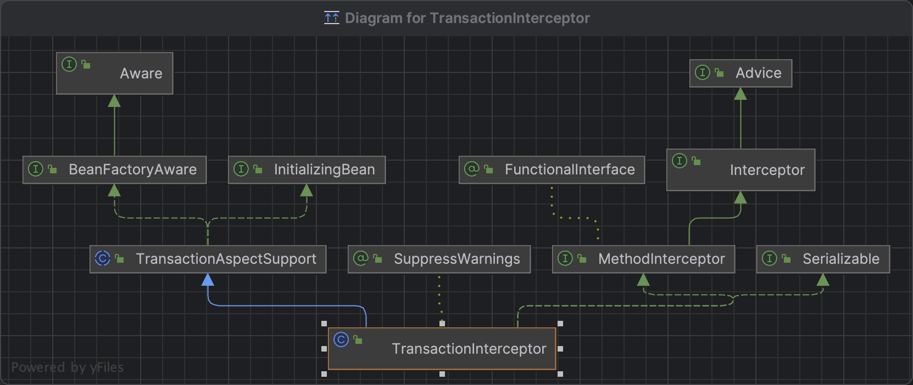
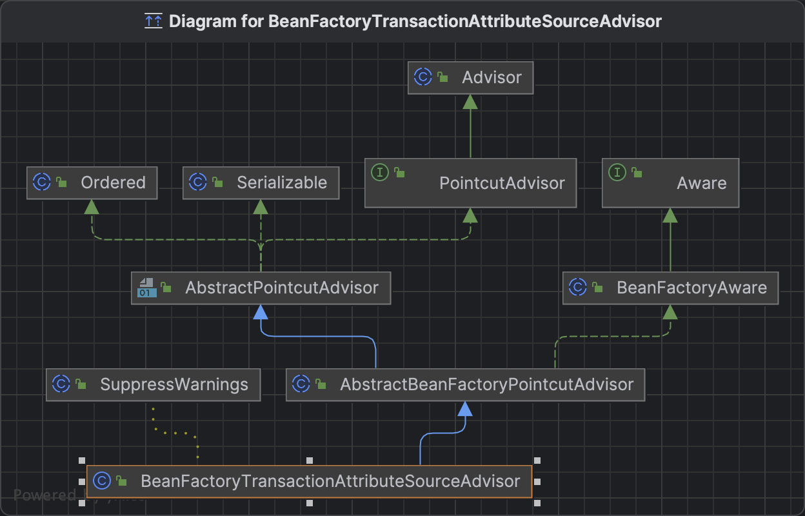
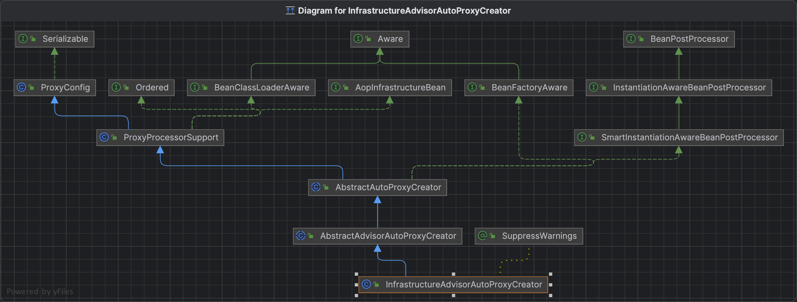

# SpringBoot 事务源码

在使用时，我们通过 `@EnableTransactionManagement` 注解开启事务

```java
@EnableTransactionManagement
public class Application {

    public static void main(String[] args) {
        SpringApplication.run(Application.class, args);
    }
}
```


## 一、@EnableTransactionManagement

```java
@Target(ElementType.TYPE)
@Retention(RetentionPolicy.RUNTIME)
@Documented
@Import(TransactionManagementConfigurationSelector.class)
public @interface EnableTransactionManagement {

	boolean proxyTargetClass() default false;

	AdviceMode mode() default AdviceMode.PROXY;

	int order() default Ordered.LOWEST_PRECEDENCE;

}
```

`@EnableTransactionManagement` 源码中可以看到 默认的代理模式（`AdviceMode`）是 `AdviceMode.PROXY`，然后通过 `@Import` 注解引入了 `TransactionManagementConfigurationSelector`


## 二、TransactionManagementConfigurationSelector.class

```java
public class TransactionManagementConfigurationSelector extends AdviceModeImportSelector<EnableTransactionManagement> {

	/**
	 * Returns {@link ProxyTransactionManagementConfiguration} or
	 * {@code AspectJ(Jta)TransactionManagementConfiguration} for {@code PROXY}
	 * and {@code ASPECTJ} values of {@link EnableTransactionManagement#mode()},
	 * respectively.
	 */
	@Override
	protected String[] selectImports(AdviceMode adviceMode) {
		switch (adviceMode) {
			case PROXY:
				return new String[] {AutoProxyRegistrar.class.getName(),
						ProxyTransactionManagementConfiguration.class.getName()};
			case ASPECTJ:
				return new String[] {determineTransactionAspectClass()};
			default:
				return null;
		}
	}

}
```

`TransactionManagementConfigurationSelector` 可以看到 `selectImports()` 方法会根据不同 `AdviceMode`向 Spring 注入 bean

由于默认的 `AdviceMode` 是`PROXY` 所以会向 Spring 容器中注入 `AutoProxyRegistrar`、`ProxyTransactionManagementConfiguration`


## 三、ProxyTransactionManagementConfiguration.class

```java
@Configuration(proxyBeanMethods = false)
@Role(BeanDefinition.ROLE_INFRASTRUCTURE)
public class ProxyTransactionManagementConfiguration extends AbstractTransactionManagementConfiguration {

	@Bean(name = TransactionManagementConfigUtils.TRANSACTION_ADVISOR_BEAN_NAME)
	@Role(BeanDefinition.ROLE_INFRASTRUCTURE)
	public BeanFactoryTransactionAttributeSourceAdvisor transactionAdvisor(
			TransactionAttributeSource transactionAttributeSource, TransactionInterceptor transactionInterceptor) {

		BeanFactoryTransactionAttributeSourceAdvisor advisor = new BeanFactoryTransactionAttributeSourceAdvisor();
		advisor.setTransactionAttributeSource(transactionAttributeSource);
		advisor.setAdvice(transactionInterceptor);
		if (this.enableTx != null) {
			advisor.setOrder(this.enableTx.<Integer>getNumber("order"));
		}
		return advisor;
	}

	@Bean
	@Role(BeanDefinition.ROLE_INFRASTRUCTURE)
	public TransactionAttributeSource transactionAttributeSource() {
		return new AnnotationTransactionAttributeSource();
	}

	@Bean
	@Role(BeanDefinition.ROLE_INFRASTRUCTURE)
	public TransactionInterceptor transactionInterceptor(TransactionAttributeSource transactionAttributeSource) {
		TransactionInterceptor interceptor = new TransactionInterceptor();
		interceptor.setTransactionAttributeSource(transactionAttributeSource);
		if (this.txManager != null) {
			interceptor.setTransactionManager(this.txManager);
		}
		return interceptor;
	}

}
```

`ProxyTransactionManagementConfiguration` 它定义了三个bean并注入 Spring 容器中

事务属性 ：`TransactionAttributeSource`

事务拦截器：`TransactionInterceptor` （引入 TransactionAttributeSource）

事务通知器：`BeanFactoryTransactionAttributeSourceAdvisor`（引入 TransactionInterceptor）

并且都是用了 `@Role(BeanDefinition.ROLE_INFRASTRUCTURE)` 表示 bean 是属于 Spring 容器自己使用的

### 1.TransactionInterceptor



TransactionInterceptor 实现了 `MethodInterceptor `最顶层是一个 `Advice` ，并且继承了 `TrasactionAspectSupport `，

`MethodInterceptor` ：拥有拦截方法能力

`TrasactionAspectSupport `：事务的基类，拥有事务能力

所以，`TransactionInterceptor` 拥有拦截方法并开启事务的能力。


### 2.BeanFactoryTransactionAttributeSourceAdvisor



`BeanFactoryTransactionAttributeSourceAdvisor` 继承了 `AbstractBeanFactoryPointcutAdvisor` 拥有一个 `pointcut`（切点）

`ProxyTransactionManagementConfiguration` 注入 bean 的时候 set 了 `TransactionAttributeSource`，并且在 `BeanFactoryTransactionAttributeSourceAdvisor`  源码中可以看到 `TransactionAttributeSource` 就是 `pointcut`

```java
public class BeanFactoryTransactionAttributeSourceAdvisor extends AbstractBeanFactoryPointcutAdvisor {

	@Nullable
	private TransactionAttributeSource transactionAttributeSource;

	private final TransactionAttributeSourcePointcut pointcut = new TransactionAttributeSourcePointcut() {
		@Override
		@Nullable
		protected TransactionAttributeSource getTransactionAttributeSource() {
			return transactionAttributeSource;
		}
	};

	public void setTransactionAttributeSource(TransactionAttributeSource transactionAttributeSource) {
		this.transactionAttributeSource = transactionAttributeSource;
	}
  
  	@Override
	public Pointcut getPointcut() {
		return this.pointcut;
	}
}
```


## 四、AutoProxyRegistrar

`TransactionManagementConfigurationSelecto`r 注册的另一个 `Bean` 是 `AutoProxyRegistrar`

`AutoProxyRegistrar` 实现了 `ImportBeanDefinitionRegistrar`，通过 `registerBeanDefinitions()` 向容器注册 Bean

```java
public class AutoProxyRegistrar implements ImportBeanDefinitionRegistrar {
  
	@Override
	public void registerBeanDefinitions(AnnotationMetadata importingClassMetadata, BeanDefinitionRegistry registry) {
		boolean candidateFound = false;
		Set<String> annTypes = importingClassMetadata.getAnnotationTypes();
		for (String annType : annTypes) {
			AnnotationAttributes candidate = AnnotationConfigUtils.attributesFor(importingClassMetadata, annType);
			if (candidate == null) {
				continue;
			}
			Object mode = candidate.get("mode");
			Object proxyTargetClass = candidate.get("proxyTargetClass");
			if (mode != null && proxyTargetClass != null && AdviceMode.class == mode.getClass() &&
					Boolean.class == proxyTargetClass.getClass()) {
				candidateFound = true;
				if (mode == AdviceMode.PROXY) {
					AopConfigUtils.registerAutoProxyCreatorIfNecessary(registry);
					if ((Boolean) proxyTargetClass) {
						AopConfigUtils.forceAutoProxyCreatorToUseClassProxying(registry);
						return;
					}
				}
			}
		}
	}

}
```

在实现中会调用 `AopConfigUtils.registerAutoProxyCreatorIfNecessary(registry)` 

```java
public abstract class AopConfigUtils {
  
  	@Nullable
	public static BeanDefinition registerAutoProxyCreatorIfNecessary(BeanDefinitionRegistry registry) {
		return registerAutoProxyCreatorIfNecessary(registry, null);
	}

	@Nullable
	public static BeanDefinition registerAutoProxyCreatorIfNecessary(
			BeanDefinitionRegistry registry, @Nullable Object source) {

		return registerOrEscalateApcAsRequired(InfrastructureAdvisorAutoProxyCreator.class, registry, source);
	}
  
  	@Nullable
	private static BeanDefinition registerOrEscalateApcAsRequired(
			Class<?> cls, BeanDefinitionRegistry registry, @Nullable Object source) {
		// 省略部分代码...
		RootBeanDefinition beanDefinition = new RootBeanDefinition(cls);
		beanDefinition.setSource(source);
		beanDefinition.getPropertyValues().add("order", Ordered.HIGHEST_PRECEDENCE);
		beanDefinition.setRole(BeanDefinition.ROLE_INFRASTRUCTURE);
		registry.registerBeanDefinition(AUTO_PROXY_CREATOR_BEAN_NAME, beanDefinition);
		return beanDefinition;
	}

}
```

最终会向容器注册一个 `InfrastructureAdvisorAutoProxyCreator ` Bean;


### 1.InfrastructureAdvisorAutoProxyCreator



从继承关系图上我们主要关注几个类

`AbstractAdvisorAutoProxyCreator` 拥有创建 AOP 代理类的能力，

`AbstractAutoProxyCreator` 实现了 `InstantiationAwareBeanPostProcessor` ，在并实现了 `postProcessBeforeInstantiation`（会在 `Bean`初始化之前调用，如果方法返回非 null 对象，则 Bean 创建过程则短路，否则会继续执行初始化） 和 `postProcessAfterInitialization` 两个方法，可以猜测会对 Bean 做一些事情，这里可能就是去将 Bean 创建成代理类了

 `BeanFactoryAware` 接口让它拥有从 `BeanFactory`  获取 `Bean` 的能力


### 2.AbstractAutoProxyCreator

先从 `AbstractAutoProxyCreator` 实现的 `postProcessBeforeInstantiation()` 方法入手

```java
public abstract class AbstractAutoProxyCreator extends ProxyProcessorSupport
		implements SmartInstantiationAwareBeanPostProcessor, BeanFactoryAware {

	@Override
	public Object postProcessBeforeInstantiation(Class<?> beanClass, String beanName) {
    
    // 省略...
		TargetSource targetSource = getCustomTargetSource(beanClass, beanName);
		if (targetSource != null) {
			if (StringUtils.hasLength(beanName)) {
				this.targetSourcedBeans.add(beanName);
			}
			Object[] specificInterceptors = getAdvicesAndAdvisorsForBean(beanClass, beanName, targetSource);
			Object proxy = createProxy(beanClass, beanName, specificInterceptors, targetSource);
			this.proxyTypes.put(cacheKey, proxy.getClass());
			return proxy;
		}

 }	
```

先创建 `TargetSource`，然后获取适用于当前 Bean 的通知,然后创建代理并返回。因为 `TargetSource`是Sspring 框架的复杂代理,针对代理只能单个类代理做出的扩展,我们暂时没有用到该能力,所以此处 `TargetSource` 为null，这里不会执行创建代理操作，从`AbstractAutoProxyCreator` 中看到重写 `BeanPostProcessor` 的一个方法 `postProcessAfterInitialization`，这个方法的作用是目标 Bean 实例化之后,初始化的时候可以对齐进行包装甚至替换掉,对于事务来说,可以用把事务能力包装进去，或者用具有事务能力的Bean 实例替换掉原来的,看一下实现:

```java
public abstract class AbstractAutoProxyCreator extends ProxyProcessorSupport
		implements SmartInstantiationAwareBeanPostProcessor, BeanFactoryAware {
  
	public Object postProcessAfterInitialization(@Nullable Object bean, String beanName) {
		if (bean != null) {
			Object cacheKey = getCacheKey(bean.getClass(), beanName);
			if (this.earlyProxyReferences.remove(cacheKey) != bean) {
				return wrapIfNecessary(bean, beanName, cacheKey);
			}
		}
		return bean;
	}
  
}
```

如果 Bean 被子类标识为要代理的 Bean，则会调用 `wrapIfNecessary`

```java
	protected Object wrapIfNecessary(Object bean, String beanName, Object cacheKey) {
		// 省略...
		// Create proxy if we have advice.
		Object[] specificInterceptors = getAdvicesAndAdvisorsForBean(bean.getClass(), beanName, null);
		if (specificInterceptors != DO_NOT_PROXY) {
			this.advisedBeans.put(cacheKey, Boolean.TRUE);
			Object proxy = createProxy(
					bean.getClass(), beanName, specificInterceptors, new SingletonTargetSource(bean));
			this.proxyTypes.put(cacheKey, proxy.getClass());
			return proxy;
		}

		this.advisedBeans.put(cacheKey, Boolean.FALSE);
		return bean;
	}
```

`getAdvicesAndAdvisorsForBean(bean.getClass(), beanName, null)` 会通过 `BeanFactory` 获取到容器中所有的注册的 Advisor，这里就包含了 selectImports 导入的配置类`ProxyTransactionManagementConfiguration` 注入的 `BeanFactoryTransactionAttributeSourceAdvisor` Bean。

接下来关注 `createProxy()` 创建代理类逻辑

```java
protected Object createProxy(Class<?> beanClass, @Nullable String beanName,
			@Nullable Object[] specificInterceptors, TargetSource targetSource) {

		if (this.beanFactory instanceof ConfigurableListableBeanFactory) {
			AutoProxyUtils.exposeTargetClass((ConfigurableListableBeanFactory) this.beanFactory, beanName, beanClass);
		}

		ProxyFactory proxyFactory = new ProxyFactory();
		proxyFactory.copyFrom(this);

		if (proxyFactory.isProxyTargetClass()) {
			// Explicit handling of JDK proxy targets and lambdas (for introduction advice scenarios)
			if (Proxy.isProxyClass(beanClass) || ClassUtils.isLambdaClass(beanClass)) {
				// Must allow for introductions; can't just set interfaces to the proxy's interfaces only.
				for (Class<?> ifc : beanClass.getInterfaces()) {
					proxyFactory.addInterface(ifc);
				}
			}
		}
		else {
			// No proxyTargetClass flag enforced, let's apply our default checks...
			if (shouldProxyTargetClass(beanClass, beanName)) {
				proxyFactory.setProxyTargetClass(true);
			}
			else {
				evaluateProxyInterfaces(beanClass, proxyFactory);
			}
		}

		Advisor[] advisors = buildAdvisors(beanName, specificInterceptors);
		proxyFactory.addAdvisors(advisors);
		proxyFactory.setTargetSource(targetSource);
		customizeProxyFactory(proxyFactory);

		proxyFactory.setFrozen(this.freezeProxy);
		if (advisorsPreFiltered()) {
			proxyFactory.setPreFiltered(true);
		}

		// Use original ClassLoader if bean class not locally loaded in overriding class loader
		ClassLoader classLoader = getProxyClassLoader();
		if (classLoader instanceof SmartClassLoader && classLoader != beanClass.getClassLoader()) {
			classLoader = ((SmartClassLoader) classLoader).getOriginalClassLoader();
		}
		return proxyFactory.getProxy(classLoader);
	}
```

先创建 `ProxyFactory`（代理工厂），然后添加 Advisor（通知器），设置要代理的目标类，然后调用 `proxyFactory.getProxy(classLoader)` 创建代理

```java
public class ProxyFactory extends ProxyCreatorSupport {	
  
  public Object getProxy(@Nullable ClassLoader classLoader) {
      return createAopProxy().getProxy(classLoader);
    }
  
}
```

会调用 `createAopProxy()`，最终会调用 `DefaultAopProxyFactory#createAopProxy()`

```java
public class DefaultAopProxyFactory implements AopProxyFactory, Serializable {
  
  	@Override
	public AopProxy createAopProxy(AdvisedSupport config) throws AopConfigException {
		if (!NativeDetector.inNativeImage() &&
				(config.isOptimize() || config.isProxyTargetClass() || hasNoUserSuppliedProxyInterfaces(config))) {
			Class<?> targetClass = config.getTargetClass();
			if (targetClass == null) {
				throw new AopConfigException("TargetSource cannot determine target class: " +
						"Either an interface or a target is required for proxy creation.");
			}
			if (targetClass.isInterface() || Proxy.isProxyClass(targetClass) || ClassUtils.isLambdaClass(targetClass)) {
				return new JdkDynamicAopProxy(config);
			}
			return new ObjenesisCglibAopProxy(config);
		}
		else {
			return new JdkDynamicAopProxy(config);
		}
	}
}
```

根据proxyTargetClass和接口特性决定使用jdk的动态代理JdkDynamicAopProxy还是cglib的动态代理ObjenesisCglibAopProxy。

两者都实现了AopProxy接口用于创建代理,jdk动态代理也实现了InvocationHandler接口,将其本身也定义成一个代理执行器,代理目标类逻辑执行的时候对调用其invoke方法。因为默认配置是 JDK动态代理，所以创建的是 JdkDynamicAopProxy，jdk动态代理的生成逻辑如下:

```java
final class JdkDynamicAopProxy implements AopProxy, InvocationHandler, Serializable {	
  
  @Override
    public Object getProxy(@Nullable ClassLoader classLoader) {
      if (logger.isTraceEnabled()) {
        logger.trace("Creating JDK dynamic proxy: " + this.advised.getTargetSource());
      }
      return Proxy.newProxyInstance(classLoader, this.proxiedInterfaces, this);
    }
}
```

而代理类会在被调用方法时，会执行 invoke 方法，也就是TransactionInterceptor 的 invoke 方法

