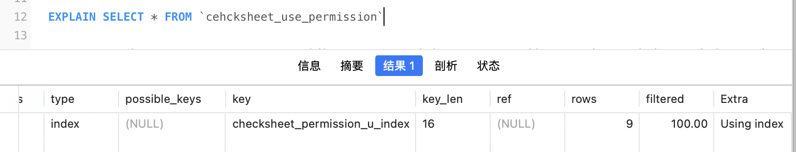
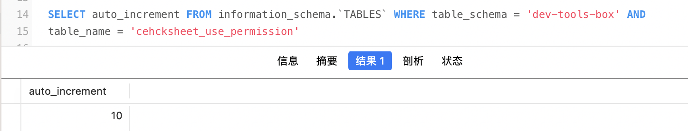
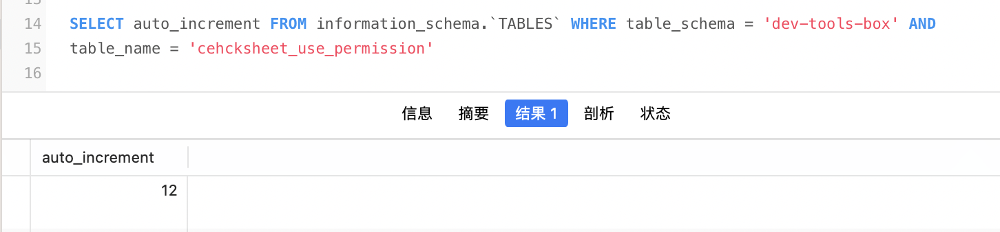

# 一、背景

我们的项目是以检查开展业务，可以增删改检查表，产品希望检查表进行权限设置，只有拥有指定权限的用户，才可以使用检查表。

在开发中我在数据库中创建了一张 `cehcksheet_use_permission`（检查表使用权限表）并使用了唯一索引去做约束

SQL：

```mysql
CREATE TABLE cehcksheet_use_permission(
	`id` bigint primary key AUTO_INCREMENT,
  `checksheet_id` bigint not null,
  `permission_id` bigint not null,
  UNIQUE INDEX checksheet_permission_u_index(`checksheet_id`,`permission_id`)
) 
```

项目数据库技术：MySQL InnoDB 存储引擎

# 二、现象

1. 当我分别对检查表id 100、101、102 设置了 权限id 120

   ```mysql
   INSERT INTO `cehcksheet_use_permission`(`checksheet_id`,`permission_id`) VALUES(100,120),(101,120),(102,120)
   ```

   数据库中看到的数据是

   | id   | checksheet_id | permission_id |
   | ---- | ------------- | ------------- |
   | 1    | 100           | 120           |
   | 2    | 101           | 120           |
   | 3    | 102           | 120           |

2. 当我再次分别对检查表id 100、101、102 设置了 权限id 90

   ```mysql
   INSERT INTO `cehcksheet_use_permission`(`checksheet_id`,`permission_id`) VALUES(100,90),(101,90),(102,90)
   ```

   数据库中看到的数据是

   | id   | checksheet_id | permission_id |
   | ---- | ------------- | ------------- |
   | 4    | 100           | 90            |
   | 1    | 100           | 120           |
   | 5    | 101           | 90            |
   | 2    | 101           | 120           |
   | 6    | 102           | 90            |
   | 3    | 102           | 120           |

   从第二次的批量插入数据可以看到，***<u>后插入的数据没有按照id去排序了，看起来像是根据联合唯一索引去排序了</u>***

3. 尝试第三次插入数据，验证想法，再次分别对检查表id 100、101、102 设置了 权限id 140

   ```sql
   INSERT INTO `cehcksheet_use_permission`(`checksheet_id`,`permission_id`) VALUES(100,140),(101,140),(102,140)
   ```

   数据库中看到的数据是

   | id   | checksheet_id | permission_id |
   | ---- | ------------- | ------------- |
   | 4    | 100           | 90            |
   | 1    | 100           | 120           |
   | 10   | 100           | 140           |
   | 5    | 101           | 90            |
   | 2    | 101           | 120           |
   | 11   | 101           | 140           |
   | 6    | 102           | 90            |
   | 3    | 102           | 120           |
   | 12   | 102           | 140           |

   数据看起来像是真的在 INSERT 时按照联合唯一索引去排序插入，为什么会导致这样子呢？

# 三、分析

## 1 通过 SELECT * FROM 查询时，数据是如何排序的

使用 EXPLAIN 关键字执行

```sql
EXPLAIN SELECT * FROM `cehcksheet_use_permission`
```

结果:



可以看到使用了唯一索引，也就是说当我们通过 `SELECT * FROM` 查询时，MySQL 自动会我们选择了索引


## 2 那么当 INSERT 唯一索引有发挥作用吗

在创建表的时候我设置了主键索引（`id`）以及联合唯一索引(` checksheet_permission_u_index`)


### 2.1 主键索引 INSERT 时工作原理

网上有很多现成的文章，找了几个不错的，我也就不在重复赘述找了几个帖子

1. [MySQL索引总结 - 知乎 (zhihu.com)](https://zhuanlan.zhihu.com/p/29118331)
2. [mysql为什么建议使用自增主键 - 知乎 (zhihu.com)](https://zhuanlan.zhihu.com/p/71022670)

总结：在 MySQL InnoDB 中当我们设置了主键索引。其实现时一个B+树（**聚簇索引**），在 INSERT 时，因为是主键自增，保证有了有序，所以可以直接在最后索引的最后插入数据，减少了页分裂，频繁的因为排序问题去重新维护B+树


### 2.2 唯一索引 INSERT 时工作原理

找到了两个关于这方面的文章帖子

1. [MySQL 普通索引和唯一索引的区别 - 禺期 - 博客园 (cnblogs.com)](https://www.cnblogs.com/hhhhuanzi/p/12318504.html)
2. https://stackoverflow.com/questions/28084901/how-does-mysql-determine-if-an-insert-is-unique
3. [深入探究Mysql联合索引的原理——B树|B+树|回表|联合索引|索引覆盖|索引失效_mysql 联合索引建树原理_coke007的博客-CSDN博客](https://blog.csdn.net/kexiaoleqq/article/details/118497584)

其实网上对于唯一索引的工作原理的资料很少，这些是我找的比较清晰的相关文章


### 2.3 那么主键索引和唯一索引同时拥有时，如何工作呢？

我们知道主键设置了自增后，是有 MySQL 分配的 ID，这个 ID 在发生事务回滚时，ID 值也是不会回滚的，那么我们可以插入一条重复数据，看看失败之后的自增ID 是否增加了，如果增加了，那么就是先分配了 ID，先使用主键索引去插入数据，然后又使用唯一索引校验了数据是否重复

#### 2.3.1 当前的自增 ID 值 d



当前自增 ID 值10


#### 2.3.2 尝试新增一条重复数据

```mysql
INSERT INTO `cehcksheet_use_permission`(`checksheet_id`,`permission_id`) VALUES(100,90)
```

这条是已经添加过得数据，执行后 MySQL 会抛出异常提示： 1062 - Duplicate entry '100-90' for key 'checksheet_permission_u_index'


#### 2.3.3 再次查看自增 ID 值



可以看到自增 ID 值改变了（因为我手误操作了两次，所以这里自增 ID 值展示的是 12）由此可以证明在 INSERT 时数据库会先按照主键插入数据

1. 因为唯一索引树节点持有的是主键ID，而主键索引树又是聚簇索引，所以只有先根据主键索引树，插入数据
2. 然后在维护唯一索引时，唯一索引持久的是主键的ID，这时候会进行唯一判断，唯一则插入成功，重复则抛出异常


# 四、 总结

### 1. 当使用 SELECT * FROM 查询

MySQL 会根据自己判断选择最适合的索引


### 2. 当一个表同时拥有主键索引和唯一索引，INSERT 时

会先根据主键索引插入数据（因为主键索引又是聚簇索引），然后在维护唯一索引树，这时候进行唯一判断
